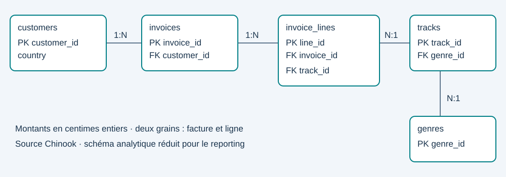

# Analyse et reporting SQL — ventes d'une boutique musicale

 Une base relationnelle, cinq questions métier et un reporting vérifié, exécutables sans compte cloud.



## Problème et périmètre

Transformer des ventes au niveau ligne de facture en indicateurs cohérents : évolution mensuelle, contribution des pays, classement des genres, valeur client et réachat. La source est **Chinook v1.4.5**, base de démonstration : les ventes sont générées et ne représentent pas une entreprise réelle.

Le schéma analytique à cinq tables est construit à partir d'une sélection de la base source. Les coordonnées fictives inutiles au reporting ne sont pas reprises. Les montants sont stockés en centimes entiers pour éviter les erreurs d'arrondi des sommes.

## Lancer le projet

Python 3.12 ou ultérieur ; le pipeline principal utilise seulement la bibliothèque standard.

```bash
python run.py
python -m unittest discover -s tests -v
```

Le premier lancement télécharge la base publique (environ 1 Mo). Les suivants utilisent le fichier local. Ouvrir **[reports/dashboard.html](reports/dashboard.html)** dans un navigateur. Le tableau de bord est autonome, sans serveur ni connexion extérieure. [Synthèse exécutée](reports/synthese.md).

Pour le notebook : `pip install -r requirements-notebook.txt`, puis ouvrir `notebooks/analyse.ipynb` avec Jupyter ou VS Code. Il charge les résultats fournis ; `REBUILD=True` relance le pipeline.

## Organisation et décisions

| Fichier | Rôle |
|---|---|
| `sql/01_schema.sql` | Tables, clés, contraintes et index |
| `sql/02_views.sql` | Grain ligne, mois, client |
| `sql/03_analysis.sql` | Jointures, CTE, sous-requête, LAG et DENSE_RANK |
| `run.py` | Ingestion, transformation, contrôles, CSV et HTML |
| `data/processed/` | Base reconstruite et tables CSV, exclues de Git |
| `reports/` | Résultats vérifiables et tableau de bord |
| `docs/indicateurs.md` | Définitions et limites |
| `docs/aws.md` | Extension PostgreSQL/RDS, non déployée |

La reconstruction produit une base temporaire et ne remplace la base de reporting qu'après réussite des contrôles. Les requêtes sont versionnées indépendamment du code Python. Une exécution planifiée peut lancer `python run.py` depuis le planificateur de tâches ; toute erreur renvoie un code non nul. Aucun planning n'est installé par ce dépôt.

## Contrôles

- Intégrité des clés étrangères et contraintes de prix/quantité.
- Rapprochement du total de chaque facture avec ses lignes.
- Nombre de lignes stable après enrichissement par jointures.
- CA global identique entre les niveaux facture et ligne.
- Présence de mois consécutifs avant de calculer une croissance mensuelle.

Ne jamais sommer `invoices.total_cents` après une jointure 1-N vers les lignes : une facture serait comptée plusieurs fois. Les clients actifs mensuels ne s'additionnent pas pour obtenir les clients uniques annuels.

## Sources et attribution

- [Chinook / Luis Rocha](https://github.com/lerocha/chinook-database), licence MIT ; données téléchargées séparément, non intégrées à l'archive du code.
- [Tutoriel SQL sélectionné dans le portfolio](https://www.youtube.com/watch?v=7mz73uXD9DA), ressource d'apprentissage, pas code recopié.

Cette version a été créée avec assistance IA à partir du descriptif du CV et du portfolio, sans code historique fourni. Elle ne prouve pas un ancien déploiement AWS. Lire le code, rejouer les analyses et personnaliser les conclusions avant présentation en entretien.
